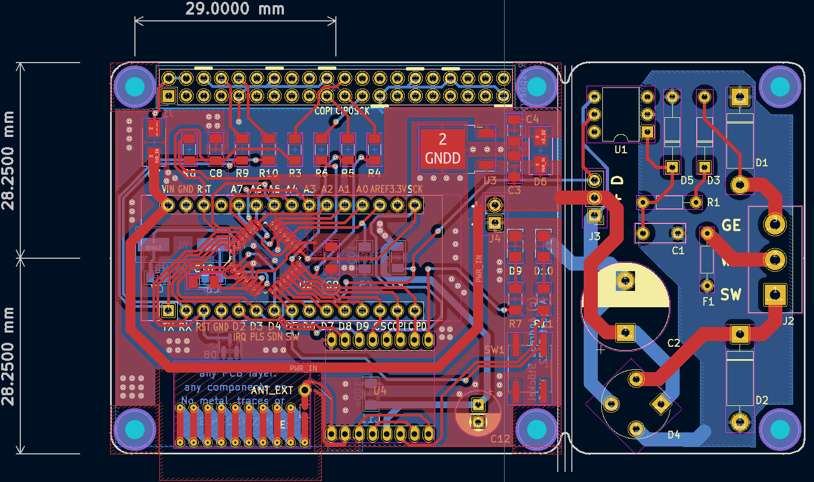
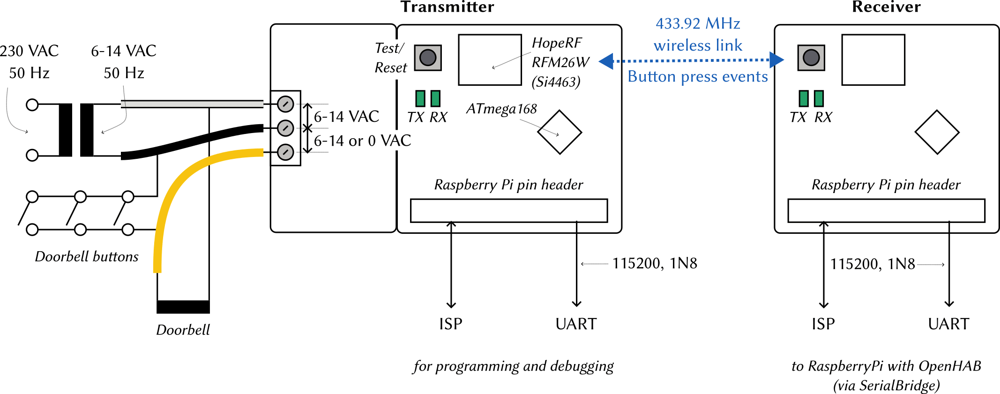

# Wireless Doorbell
**A hopelessly overengineered wireless doorbell transmitter (and Raspberry Pi AVR prototyping HAT)**



> **Warning**  
> This project is provided as-is and likely not of use to anyone else; at least not without modifications. Note that:
> 1. The PCB (especially the AC supply) was designed for parts the author had lying around. Many of these parts may be obsolete.
> 2. This project solves a very niche problem.
> 3. The firmware uses plain-text wireless transmission without encryption or signatures. This is fine for the author's use case, where all an adversary can accomplish is to wirelessly ring the doorbell. A sneaky hacker could of course just press the doorbell button on the street to the same effect.
>
> **The author of this repository takes no responsibility for any damage resulting from using the electronic devices described here.**
> **You are responsible for making sure that operating these devices meets all relevant regulatory requirements in your region.**

This repository contains the PCB and firmware for a Si4463-based (on a HopeRF RFM26W module) wireless doorbell operating on the 433 MHz ISM band.
The Si4463 is controlled using an ATmega168 µC (the project requires about 6kiB of flash memory).

Doorbell button presses are transmitted wirelessly between two of these PCBs.
One of the PCBs serves as a Raspberry Pi HAT, where button press events are forwarded via UART to [OpenHAB](https://www.openhab.org/) (using [Serial Bridge and Serial Device](https://www.openhab.org/addons/bindings/serial/)).
In turn, OpenHAB has a rule that causes all SIP phones in the house to ring via [FemtoSIP](https://github.com/astoeckel/femtosip).

The left side of the PCB is a Raspberry Pi compatible AVR Microcontroller HAT (for the ATmega168/ATMega328 family) with Arduino-compatible pin headers and space for the HopeRF RFM26W module (note that this module seems to be obsolete).
The right side of the PCB is an low-voltage AC power supply with 50 Hz pulse extraction and is designed to be sawed off if not in use.

Since PCB prototyping services often produce at least 5-10 PCBs, the PCB was designed with some versatility in mind.
Correspondingly, the left side of the PCB has far more pin headers as necessary, and can be used as a general-purpose ATmega168/328 development board.
Specifically, the AVR can be programmed directly by the Raspberry Pi (no ISP programmer required) and can communicate via UART (the schematic suggests the use of a 14.7456 MHz crystal for stable high-speed communication).

## Overview



The above diagram depicts how the PCB is intended to be used.
One instance of the PCB is directly powered by the low-voltage doorbell AC transformer; the other instance is powered by the 5V power supply of a Raspberry Pi.

Button presses are recognized by the doorbell button shorting out the yellow and black wires in the above diagram.
Correspondingly, the 50 Hz oscillations disappear on the yellow wire; this is recognized by the ATmega168 microcontroller which sends a few digital packets of the form
```
$DBG,<BUTTON PRESSED>,<SEQ>
```
to the receiver at a baud rate of 10kbps.
`<BUTTON PRESSED>` is set to `1` if the 50 Hz signal goes away; it is set to `0` once the signal reappears.
Every packet is repeated five times; with each repetition `<SEQ>` is incremented by one (starting from `0`).

## Schematics and Gerber files

* **Gerber files**  
  The Gerber files used for production can be found in the `gerber` folder (the author is not aware of any bugs on the PCB).
* **Schematic and KiCAD sources**  
  The KiCAD source files are in the `kicad` folder. A printout of the schematics in [PDF form](doc/schematics.pdf) can be found in the `doc` folder.

## Firmware

The firmware is located in the `code` folder.
It uses `avr-gcc` and `avr-libc`, as well as `avrdude` with the [linuxspi patches](https://github.com/kcuzner/avrdude).

It can be compiled and flashed using [meson](https://mesonbuild.com/) as follows:
```sh
cd code; mkdir -p build
meson setup --cross-file ../avr-unknown-gcc.txt ..
ninja
ninja flash  # Requires avrdude with linuxspi when flashing directly from the RPi
```

## Usage

The firmware automatically decides whether it acts as the receiver or transmitter depending on the presence of the 50 Hz pulse from the yellow wire in the above diagram.
Once a stable series of 50 Hz pulse are received, the device is in “transmitter” mode.

### Antenna
Note that the antenna on the board is designed for 868 MHz and does not have a large gain (close the solder bridge `J` on the board to activate the internal antenna).
In the final device, I'm using [this antenna](https://www.instructables.com/433-MHz-Coil-loaded-antenna/) ([PDF instructions by Ben Schueler](https://drive.google.com/file/d/1E9KPAPJrZRgGLOQqwd2-3-Px0MuSVreY/view)) soldered directly to the RFM26W module (the antenna is not connected to the PCB).

### Receiver

1. Connect UART RX/TX pins and 5V power (use a baud rate of 115200) to Raspberry Pi
2. The `RX` LED should be illuminated; the LED will blink rapidly if the receiver receives any data.
3. Incoming messages will be printed as a one-line JSON-encoded string to UART
4. Shortly pressing the SMD button on the board will send a `PING` request. If any board responds with a `PONG`, both the `RX` and `TX` LED will blink rapidly for two seconds. *Note:* The transmitter is usually in energy saving mode and will not respond. Wake the transmitter up by pressing the SMD button there.
5. Pressing the SMD button for at least 3 seconds will reset the µC on the board.

### Transmitter
1. Connect the three doorbell wires as indicated in the diagram above.
2. The `RX` led will blink once every second if the 50 Hz pulse has been recognized; the board will go to a 3-4mA power-save mode (this is to prevent the linear voltage regulator from becoming too hot).
3. If the 50 Hz signal goes away, the transmitter will send a message to the receiver as described above. The `TX` LED should blink rapidly.
4. Shortly pressing the SMD button will send a `PING` request and rapidly blink both LEDs if it receives a response. Furthermore, the transmitter will leave power-save mode for one minute; it can now respond with `PONG` to `PING` messages issued by the receiver.
5. Pressing the SMD button for 3 seconds will reset the µC on the board.

## License

Note that this project consists of both hardware and to a smaller portion of software. Both parts are made available under different licenses.

### Hardware schematics

    Copyright Andreas Stöckel 2022.
    
    This documentation describes Open Hardware and is licensed under the
    CERN OHL v. 1.2. You may redistribute and modify this documentation under
    the terms of the CERN OHL v.1.2. (http://ohwr.org/cernohl). This
    documentation is distributed WITHOUT ANY EXPRESS OR IMPLIED WARRANTY,
    INCLUDING OF MERCHANTABILITY, SATISFACTORY QUALITY AND FITNESS FOR A
    PARTICULAR PURPOSE. Please see the CERN OHL v.1.2 for applicable conditions.

### Software (AVR firmware and host programs)

    This program is free software: you can redistribute it and/or modify
    it under the terms of the GNU General Public License as published by
    the Free Software Foundation, either version 3 of the License, or
    (at your option) any later version.
    
    This program is distributed in the hope that it will be useful,
    but WITHOUT ANY WARRANTY; without even the implied warranty of
    MERCHANTABILITY or FITNESS FOR A PARTICULAR PURPOSE.  See the
    GNU General Public License for more details.
    
    You should have received a copy of the GNU General Public License
    along with this program.  If not, see <http://www.gnu.org/licenses/>.
